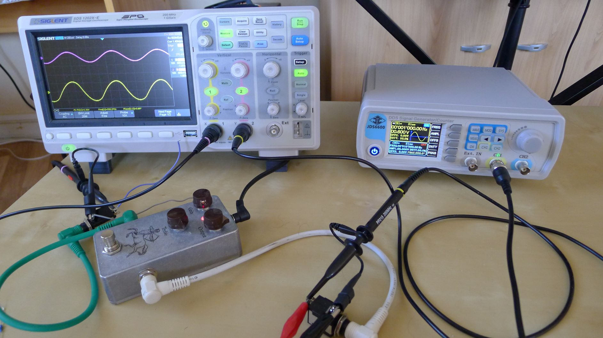
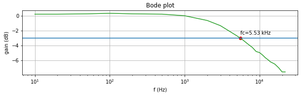
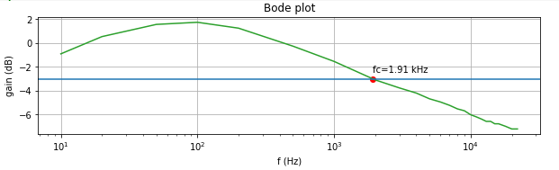

# Bode plot

This python notebook allows to analyse the frequency response and trace the bode plot of a device (guitar pedal, filter, ...)

The script connects to the a Siglent osccilloscope and a JDS6600 via NI-VISA or serial and issue SCPI commands.

RC filter

Klone with tone at the maximum

